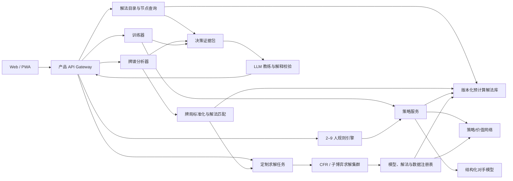

# RiverMind 德州扑克智能训练产品项目计划书

> 版本：v0.3  
> 日期：2026-08-18  
> 项目阶段：Phase 0 / Beta 工程启动  
> 核心原则：专用策略系统负责行动决策；LLM 负责解释、教学表达与受约束的对手画像，不直接决定下注动作。

---

## 1. 执行摘要

RiverMind 是一款面向认真学习者、教练和扑克 AI 研究者的综合德州扑克学习与分析平台。长期形态参考 GTO Wizard 已验证的 **Study → Practice → Analyze** 闭环，但第一阶段不从大规模 GTO 解法生产起步，而是用 **H2N-lite 牌谱分析** 建立最快的用户入口和数据底座。

当前产品定位是：**不做纯 H2N；先用 H2N-lite 找到用户真实漏洞，再以 GTO 策略系统和 AI 教练完成差异化。**

交付顺序如下：

1. **8–12 周 H2N-lite Beta：** 牌谱导入、Session/统计报告、过滤、手牌回放、漏洞识别和证据约束的 AI 解释；
2. **3–6 个月 GTO 闭环：** 将高频漏洞映射到经过验证的解法，提供 Study、Practice 和复测；
3. **7–12 个月策略平台：** 扩展 6-max Cash、MTT、Spin/HU SNG、ICM/PKO、多人场景和定制求解。

第一阶段通过“牌谱解析器 → 规范化事件 → 确定性统计 → 漏洞证据 → AI 教练”形成闭环。后续接入“预计算 CFR 解法库 + 专用策略/价值网络 + 按需子博弈求解 + 受约束对手模型”。LLM 只把结构化结果转化为解释、问答和学习计划，不直接计算统计或决定 `fold/call/raise`。

项目不开发真实资金牌局、代打、自动点击、牌局平台注入、屏幕识别或实时辅助外挂。成功标准不是宣称所有赛制都达到“绝对 GTO”，而是对每个解法包明确规则、覆盖范围、精度、抽象和版本，并让用户能从实际牌谱一键进入学习与针对性训练。

### 1.1 产品定位

**一句话定位：** 从你的真实牌谱发现漏洞，并用可信 GTO 证据教会你如何修正的德州扑克 AI 教练。

**核心差异：**

- 策略与语言解耦：LLM 宕机不影响 Bot 合法出牌；LLM 的语言偏好不能改变行动。
- 数据入口优先：先解决导入、统计和漏洞发现，再按真实需求生产 GTO 解法。
- 结论可追溯：每段解释必须引用策略服务产出的动作概率、EV、范围或对手证据。
- 平衡与利用分层：默认使用稳健的近似均衡策略，只有在证据充分且风险预算允许时才做受约束偏离。
- 训练优先：产品帮助用户理解和练习，不为线上真实资金牌局提供隐蔽实时建议。

### 1.2 关键产品假设

| 假设 | 原因 | 验证方式 |
|---|---|---|
| 用户愿意为“可信解释”而非单一动作建议付费 | 现有求解器学习门槛高 | 10–15 名目标用户访谈 + 原型测试 |
| H2N-lite 能以更低工程成本形成首个高频入口 | 用户已有牌谱，统计和复盘价值无需等待求解器 | 首次导入率、周导入次数、D14 留存 |
| 用户首先需要广泛、可即时访问的常见解法 | GTO 阶段的高频学习依赖覆盖面与检索速度 | 解法搜索量、无结果率、重复访问率 |
| 6-max 现金桌 + MTT 是首个商业覆盖面 | 能覆盖两类最主要学习工作流 | 用户访谈、候补名单、格式选择分布 |
| 预计算解法库 + 按需求解比单一实时模型更可控 | 高频场景要快，长尾场景要灵活 | 命中率、求解成本、映射误差、等待时间 |
| 牌谱分析是留存入口，训练是能力转化环节 | 只看矩阵难形成持续使用 | Analyze → Study → Practice 漏斗 |
| 结构化证据能约束 LLM 幻觉 | 解释不应反向影响策略 | 自动忠实性检测 + 人工抽检 |

---

## 2. 项目目标与非目标

### 2.1 业务目标

- 在 8–12 周内交付 H2N-lite 公开 Beta，在 6 个月内接入首批 GTO Study/Practice，在 12 个月内形成多赛制 v1。
- 建立“导入牌谱 → 发现漏洞 → 查看解法 → 针对性训练 → 复测”的完整闭环。
- 让用户在一个账户中按赛制、人数、位置、筹码、抽水/ante、下注线和牌面检索解法。
- 验证付费意愿：Beta 用户中至少 20% 表达明确订阅意愿，并获得 20 位个人付费种子用户或 3 个教练/战队试点。
- 建立可持续扩展的解法生产、质量评估、版本发布和成本治理体系。

### 2.2 技术目标

- Beta 首先建立统一 `HandHistory/GameEvent`，支持现金桌与 MTT 的玩家、筹码、位置、行动、牌面和结算规范化。
- 导入管道具备格式检测、拆手、去重、失败隔离、黄金牌谱回归和数据删除能力。
- 核心统计完全由确定性代码计算，并在人工黄金集上保持一致。
- GTO 阶段的游戏引擎支持 2–9 人无限注德州扑克、现金桌抽水、ante/BB ante、非对称筹码和锦标赛结算配置。
- 解法目录可表达赛制、人数、位置、有效筹码、抽水、ante、ICM/ChipEV、下注树和公共牌面等维度。
- Bot 的每次行动只读取策略服务输出，LLM 不在同步决策链路内。
- 在内部标准牌局集上，策略版本可复现、可对比、可回滚。
- 预解库查询 P95 低于 300ms；牌谱批量分析异步执行；复杂定制求解显示进度并允许队列化。
- 解释中的数值主张 100% 来自决策证据包；无证据内容必须明确标记为教学性概括或不确定判断。

### 2.3 非目标

- 前 12 个月不覆盖短牌和奥马哈；先把无限注德州扑克的平台能力做完整。
- v1 不承诺所有长尾配置都能即时求解；没有精确解法时必须显示映射、近似或排队状态。
- 不承诺多人博弈存在与两人零和相同性质的唯一“GTO 答案”，多人场景按经验质量和稳健性评估。
- 不让通用 LLM 直接生成 `fold/call/raise` 决策。
- 不接入真实资金平台，不做自动操作、隐蔽实时建议或规避平台检测。
- 不训练自有基础大语言模型；只训练扑克策略、价值、动作映射和对手模型。

---

## 3. 目标用户与核心场景

### 3.1 用户画像

| 用户 | 核心痛点 | RiverMind 提供的价值 |
|---|---|---|
| 进阶学习者 | 知道答案但不理解范围和频率 | 用分层解释把策略转化为可练习规则 |
| 教练 | 备课与逐手复盘耗时 | 批量分析、错误聚类、可编辑讲解稿 |
| 俱乐部/战队研究者 | 需要统一训练基线 | 版本化策略、题库和团队数据面板 |
| AI/博弈研究者 | 缺少完整实验闭环 | 可复现实验、对战评估和策略 API |

### 3.2 核心用户旅程

1. 用户导入一段 6-max 现金桌或 MTT 牌谱。
2. 分析器识别格式并规范化赛制、人数、位置、筹码、抽水/ante、行动和结算。
3. Beta 先用确定性统计与规则找出重复漏洞，生成 session 报告和待复盘手牌集。
4. LLM 只读取结构化统计、样本量和置信度，解释“发生了什么、为什么值得关注、应该复习什么”。
5. GTO 阶段再把高价值错误节点匹配到精确或最近解法，并显式显示匹配差异。
6. 用户从 Analyze 一键跳到 Study/Practice，完成相似场景复测。
7. 系统跟踪同类场景统计和 EV 损失是否改善。

第二条旅程是“主动研究”：用户使用解法目录或定制求解器设置范围、筹码、底池、抽水/ICM 和下注树，获得策略后保存、比较、nodelock，并生成可分享训练集。

### 3.3 功能优先级

**P0：8–12 周 H2N-lite Beta**

- 两种优先牌谱格式，先支持英文文本；
- 6-max Cash 与 MTT 规范化、文件/文件夹导入、去重和错误报告；
- Session、盈亏、All-in EV、位置、底池类型与街道报告；
- 固定核心统计与常用快速过滤；
- 手牌回放、标签、收藏、导出和删除；
- 基于确定性证据的漏洞规则；
- LLM 中文解释和复习计划，所有数字从证据字段插值；
- 20–50 个高频 GTO 场景作为可选预览，不阻塞 Beta。

**P1：3–6 个月 GTO 闭环**

- 2–9 人规则引擎和统一 `GameSpec/SolutionSpec`；
- 6-max 现金桌与 MTT 高频解法包；
- 解法浏览器：策略矩阵、范围、EV/EQ、动作表和节点比较；
- 训练器：Preflop、Spot、Street、Full Hand；
- 牌谱节点精确/近似匹配、EV 损失和 Analyze → Study → Practice 跳转；
- 个人漏洞到针对性训练的复测报告。

**P2：12 个月 v1**

- 更多现金桌筹码深度、抽水和 3-bet/4-bet 解法包；
- MTT ICM、决赛桌、PKO 与非对称筹码；
- Spin 与 HU SNG 解法包；
- 常见 3-way 翻后解法与训练；
- 定制 HU 翻后求解器和下注树编辑；
- nodelock、节点对比和受约束对手建模；
- 聚合牌面报告、个人 GTO 统计和自适应学习计划；
- 教练空间、批注、分享与团队题库。

**P3：平台扩展**

- 多人定制翻前/翻后求解；
- 更广泛的 ICM/PKO 结构和自定义奖金；
- 任意下注尺度对局与动态动作翻译；
- 策略研究 API；
- 移动端优化与国际化；
- PLO 作为独立项目评估，不与德州主线混做。

### 3.4 GTO Wizard 功能基准与 RiverMind 差异化

GTO Wizard 的公开产品已经形成 Study、Practice、Analyze、预解库和定制求解的完整组合：Study 可浏览翻前到河牌的策略、范围、EV/EQ/EQR、阻断牌和聚合报告；Practice 支持整手、单街、单点和多桌训练；Analyzer 支持批量牌谱与错误/漏洞定位；定制求解支持范围、筹码、底池、下注树和 nodelock。RiverMind 应将这些视为用户对同类产品的基础预期，而不是把“有一个会打牌的 Bot”当作完整产品。

| 能力层 | 市场基准 | RiverMind v1 | 差异化方向 |
|---|---|---|---|
| Study | 大规模预解库、范围/策略/EV、聚合报告 | 6-max Cash + MTT 优先，统一节点浏览器 | 中文证据解释、概念抽取、相似局面迁移 |
| Practice | Full Hand / Street / Spot、可配置 drills | 同级训练模式 + 自适应复测 | 从个人牌谱自动生成课程 |
| Analyze | 批量牌谱、EV 损失、漏洞报告、一键跳转 | 多站点解析、精确/近似匹配、session 报告 | 解释“为什么错”并跟踪修复效果 |
| Custom Solve | 参数化范围/筹码/树、AI 求解、nodelock | 先 HU 翻后，再多人翻前/翻后 | 策略网络加速、误差透明、自然语言配置 |
| Play/Bot | 对局后分析或训练对局 | 专用策略 Bot 和教学对局 | 可调教学难度，不用 LLM 出牌 |
| Coach | 内容、报告、课程 | AI 教练 + 真人教练空间 | 证据引用、中文本地化、团队知识沉淀 |

公开资料参考：[Study Mode](https://help.gtowizard.com/study-mode/)、[Practice Mode](https://help.gtowizard.com/practice-mode-overview/)、[牌谱上传与分析](https://help.gtowizard.com/how-to-upload-your-hand-histories/)、[定制求解](https://help.gtowizard.com/how-to-build-custom-solutions/)、[Nodelocking](https://help.gtowizard.com/how-to-use-nodelocking/)。

---

## 4. 核心产品原则

### 4.1 决策权隔离

产品必须在接口层面保证：

```text
最终行动 = 策略系统(合法动作、信息集、蓝图策略、可选重求解、受约束对手偏离)
解释文本 = LLM(决策证据包、教学目标、用户水平、语言偏好)
```

LLM 输出不得包含可被游戏引擎直接执行的动作字段。游戏引擎只接受策略服务签名后的 `PolicyDecision`。

### 4.2 默认稳健，利用有预算

- 默认使用近似均衡蓝图策略。
- 对手样本不足时不做针对性调整。
- 所有 exploit 偏离均设最大幅度、最小置信度和回退条件。
- 对手风格发生变化时，优先回退到蓝图策略。
- 训练产品必须同时展示“均衡基线”和“针对该画像的可选偏离”，避免把短期利用误教成通用规则。

### 4.3 解释忠实而非听起来合理

解释分为四层：

1. **结论层：** 推荐混合策略及动作 EV；
2. **证据层：** 牌面、范围优势、坚果优势、阻断牌、赔率、下注尺度；
3. **对比层：** 用户动作与策略动作差在哪里；
4. **迁移层：** 可以应用到相似局面的学习规则。

若证据包缺少某项数据，LLM 不得自行补出精确频率、EV 或对手倾向。

---

## 5. 总体技术架构



### 5.1 四类策略请求

平台不是每个节点都实时跑同一种模型，而是按请求选择最可靠、最低成本的来源：

| 请求 | 首选来源 | 降级/补充 | 用户体验 |
|---|---|---|---|
| 浏览常见场景 | 预计算解法库 | 无结果时推荐最近配置 | 即时打开 |
| 批量牌谱分析 | 解法匹配 + 预解库 | 长尾节点进入异步定制求解 | 先出覆盖率，再逐步补齐 |
| 自定义研究 | CFR/神经求解器 | 任务排队或降低树宽 | 显示预计成本、进度和精度 |
| 训练/策略对局 | 解法采样或蒸馏策略网络 | 回退到最近已验证解法 | 低延迟连续行动 |

### 5.2 在线行动链路

1. 游戏引擎验证状态、筹码、轮次和合法动作。
2. 特征编码器根据 `GameSpec` 生成玩家可见的**信息集表示**，绝不泄漏对手底牌或未来公共牌。
3. 策略路由器优先命中当前赛制和节点的验证解法，否则调用对应策略网络或已批准的重求解服务。
4. 若用户下注尺度不在原始树内，动作翻译器给出映射误差；符合条件时触发异步精确求解。
5. 若开启对手利用，安全门根据样本量、漂移和风险预算混合蓝图与利用策略。
6. 动作采样器按策略分布采样，生成签名后的决策记录。
7. 解释服务异步读取决策证据包并生成讲解；解释失败不影响牌局。

### 5.3 解法标识与目录契约

每个解法必须由完整配置唯一标识，至少包含：

```json
{
  "format": "cash_6max",
  "players_dealt": 6,
  "stacks_bb": {"UTG": 100, "HJ": 100, "CO": 100, "BTN": 100, "SB": 100, "BB": 100},
  "blinds_bb": {"SB": 0.5, "BB": 1.0},
  "ante": null,
  "rake": {"percent": 0.05, "cap_bb": 4.0},
  "objective": "chip_ev",
  "preflop_line": ["BTN_RAISE_2.5", "BB_CALL"],
  "action_tree_version": "cash-v3",
  "solver_version": "solver-0.8.1",
  "quality_tier": "verified"
}
```

示例仅定义结构。实际抽水和下注树按目标市场单独配置。

### 5.4 决策接口契约

建议使用强类型结构，并将决策与解释彻底分开：

```json
{
  "decision_id": "uuid",
  "game_state_hash": "sha256",
  "solution_spec_id": "cash6-100bb-rakeA-btnvsbb-srp-v3",
  "policy_version": "cash6-blueprint-0.3.0",
  "legal_actions": ["fold", "call", "raise_0.75pot"],
  "action_probabilities": {
    "fold": 0.08,
    "call": 0.57,
    "raise_0.75pot": 0.35
  },
  "action_ev_bb": {
    "fold": 0.00,
    "call": 1.24,
    "raise_0.75pot": 1.31
  },
  "selected_action": "call",
  "decision_source": "presolved_library",
  "opponent_adjustment": {
    "enabled": false,
    "confidence": 0.18,
    "max_policy_shift": 0.00
  },
  "latency_ms": 42
}
```

注意：上例数值仅用于定义接口，不代表真实策略。

---

## 6. 策略系统设计

### 6.1 递进式研发路线

| 阶段 | 游戏规模 | 方法 | 目的 |
|---|---|---|---|
| 算法验证 | Kuhn / Leduc Poker | Tabular CFR / CFR+ | 验证遗憾更新、平均策略、可利用度评估 |
| 工程验证 | 小型 Hold'em 子游戏 | MCCFR + 动作抽象 | 打通状态编码、采样与并行训练 |
| 解法生产 v1 | 6-max Cash 与 MTT 高频配置 | 分布式 CFR/MCCFR + 抽象 + 精确河牌 | 建立可查询、可验证的预解库 |
| 推理加速 v1 | 解法库覆盖的多赛制节点 | 策略蒸馏、价值网络、缓存 | 支持训练器与策略 Bot 低延迟响应 |
| 定制求解 v1 | 任意 HU 翻后配置 | 深度限制求解 + 价值网络 | 处理自定义范围、筹码、底池和下注树 |
| 多人增强 | 多人翻前与常见 3-way 翻后 | 多人 CFR 变体 + 局部求解 + 经验评估 | 扩展真实牌局覆盖，不套用两人零和承诺 |
| 锦标赛增强 | ICM / PKO / 非对称筹码 | 对应效用函数、奖金模型与独立评测 | 覆盖 MTT 中后期高价值场景 |

不在立项时锁死 Deep CFR 或 SD-CFR。第 2–4 周用相同简化游戏、相同算力预算和相同评估协议，比较：

- 收敛速度；
- 策略稳定性；
- 内存与训练时长；
- 推理延迟；
- 对未见公共牌面的泛化；
- 可复现性和工程复杂度。

然后通过技术评审确定各类请求的主路线。预解库、训练 Bot 和定制求解可以采用不同算法，但必须共享规则、状态、节点、质量和版本协议。

### 6.2 解法覆盖与生产策略

广泛产品不等于一开始穷举全部组合。采用“覆盖矩阵 + 使用量驱动扩展”：

1. 产品定义 `格式 × 人数 × 筹码 × 抽水/ante × 位置 × 翻前线 × 下注树 × 牌面` 覆盖矩阵；
2. 依据牌谱样本、用户搜索和商业优先级生成待求解队列；
3. 先求高频翻前和翻后 heads-up pots，再补 3-way 与长尾配置；
4. 对花色同构、牌面聚类和相似树复用计算，但前端必须显示近似等级；
5. 每个解法经过收敛、best-response 代理、交叉求解器对比和黄金节点审核后才能标为 `verified`；
6. 新版本采用双写和差异报告，不能静默覆盖旧解法。

首批解法包建议：

| 解法包 | 首批范围 | 发布优先级 |
|---|---|---:|
| Cash 6-max 100BB | 常见抽水，RFI/盲注防守、SRP、3-bet pot | P0 |
| MTT 8-max ChipEV | 20BB/40BB/60BB，BB ante，RFI/reshove/SRP | P0 |
| Cash 扩展 | 50BB/200BB、不同抽水、4-bet pot | P1 |
| MTT ICM | 泡沫、决赛桌、非对称筹码 | P1 |
| Spin/HU SNG | 8–25BB 高频配置 | P1 |
| Multiway | 常见 3-way SRP 翻后 | P1 |
| PKO | 覆盖率和赏金结构参数化 | P1/P2 |

所有用户可见结果使用统一质量标签：

| 标签 | 含义 | 是否用于精确 EV 评分 |
|---|---|---|
| `verified` | 完成批准的收敛、交叉对比与黄金节点审核 | 是 |
| `fast_approx` | 快速定制求解，满足较宽误差阈值 | 仅显示区间或降权评分 |
| `mapped` | 从用户牌局映射到最近的已验证配置 | 必须同时显示映射差异 |
| `experimental_multiway` | 多人实验解，只有经验质量报告 | 不宣称两人式可利用度保证 |
| `unsupported` | 无可靠结果 | 不评分，允许排队请求 |

### 6.3 状态与动作表示

**私有/公共状态特征：**

- 自己两张底牌的规范化编码；
- 公共牌及花色同构；
- 2–9 个座位、存活/弃牌状态、位置、行动轮次与各自筹码；
- 底池、跟注额、SPR；
- 完整但压缩的下注历史；
- 现金桌抽水，或 MTT 的 ante、奖金/ICM/PKO 参数；
- 当前合法动作掩码；
- 规则集与下注抽象版本。

**动作抽象候选：**

- `fold`、`check/call`；
- 下注/加注：0.33、0.50、0.75、1.00、1.50 pot 与 all-in；
- 按街和 SPR 裁剪明显不适用尺度；
- 用户使用抽象外尺度时，通过动作映射或局部重求解响应，并在复盘中显示映射误差。

下注尺度需经实验确定。动作树过窄会损失策略质量，过宽会显著增加求解成本，因此每次改动都必须产生新的规则/模型版本。

### 6.4 网络与训练产物

候选网络：

- 扑克牌与公共牌使用牌面编码器；
- 下注历史使用轻量 Transformer 或序列编码器；
- 数值状态使用归一化 MLP；
- 融合后输出合法动作的 advantage/regret、策略 logits 和可选价值头。

训练产物至少包含：

- 策略权重；
- 训练配置和随机种子；
- 代码提交哈希；
- 数据/缓冲区版本；
- 规则集与动作抽象版本；
- 对战、可利用度代理指标与校准报告；
- 已知缺陷和允许部署的产品模式。

### 6.5 定制求解与在线重求解

产品将求解分为用户可见的异步定制任务与策略 Bot 内部的低延迟增强。两者都必须可关闭、可回退：

- 用户可设置范围、人数、筹码、底池、抽水/ante、效用模型和下注树；
- 创建任务前显示节点规模估计、精度档位和配额消耗；
- 交互式快速解只用于研究，批量牌谱分析优先命中预解库；
- 策略 Bot 的重求解只在预先定义的关键节点启用，并有严格时间和内存预算；
- 超时自动回退到当前 `SolutionSpec` 对应的已验证策略；
- 缓存按完整配置哈希、公共状态和下注历史键控；
- 输出必须通过合法动作掩码和概率归一化校验；
- 近似解、快速解和验证解使用不同质量标签；
- 与基线策略分别评估，防止局部改进造成全局策略不一致。

### 6.6 评估体系

不能只看与人类或旧 Bot 的短期输赢。评估分为五层：

1. **规则正确性：** 资金守恒、发牌唯一、边池/全下、回合顺序、终局结算；
2. **算法正确性：** Kuhn/Leduc 上对已知或高精度参考策略的差距；
3. **两人策略质量：** 可利用度（可计算环境）、local best response、重复对战置信区间；
4. **多人/锦标赛质量：** 交叉对战、策略扰动稳健性、已知对手池表现、ICM/奖金计算一致性；
5. **解法一致性：** 相邻筹码/下注树连续性、跨版本差异、动作映射误差；
6. **产品一致性：** 相同种子和版本可复现，非法动作率为 0；
7. **服务质量：** 查询与推理 P50/P95、求解队列等待、超时回退率、显存和吞吐。

大型无限注德州及多人游戏无法在普通工程预算内直接得到一个覆盖全产品的精确可利用度数字，因此必须结合简化游戏精确指标、局部最佳响应、交叉求解器对比、策略扰动、消融实验和大样本置信区间，避免用单一胜率或单个“准确率”夸大效果。

---

## 7. 对手建模与安全利用

### 7.1 职责边界

对手模型不是“让 LLM 猜对手有什么牌”。系统分成三层：

1. **统计层：** 从合法牌局历史计算频率、下注尺度、按位置/街道分组的行为特征；
2. **预测层：** 贝叶斯模型或专用小网络估计对手动作分布与不确定性；
3. **语言层：** LLM 把结构化特征总结为人类可读画像，或把用户输入的观察转为低权重先验。

只有前两层的版本化结构化输出能进入策略系统。LLM 生成的画像若没有牌局证据，不得直接触发策略偏离。

### 7.2 画像结构示例

```json
{
  "opponent_id": "pseudonymous-id",
  "sample_hands": 186,
  "features": {
    "vpip": {"estimate": 0.44, "credible_interval": [0.36, 0.52]},
    "river_overfold": {"estimate": 0.09, "confidence": "low"}
  },
  "segments": ["loose_preflop", "insufficient_river_sample"],
  "drift_score": 0.12,
  "model_version": "opponent-0.2.0"
}
```

以上数值同样只用于接口说明。

### 7.3 利用策略门控

定义最终策略：

```text
π_final = (1 - α) · π_blueprint + α · π_exploit
```

其中 `α` 由样本量、置信区间、对手漂移、场景覆盖率和产品模式共同决定，并受硬上限约束。v1 初始建议：

- 少于 200 手牌：`α = 0`，只显示观察，不做策略偏离；
- 200–1,000 手牌：仅内部实验，小幅偏离；
- 超过 1,000 手牌：仍需按具体节点样本量判断；
- 发现分布漂移或模型冲突：立即衰减或回退到 0；
- 用户界面明确区分“均衡建议”和“实验性对手调整”。

阈值是初始安全假设，必须通过离线仿真与红队实验校准。

---

## 8. LLM 解释系统

### 8.1 输入

LLM 只接收脱敏后的 `ExplanationEvidence`：

- 当前玩家可见信息，或 Study 模式允许公开的双方范围聚合；
- `SolutionSpec`、匹配置信度、质量档位与近似说明；
- 策略动作分布和 EV 差异；
- 范围聚合统计；
- 牌面结构标签；
- 对手画像及置信度；
- 用户实际动作；
- 教学目标与用户水平；
- 模型、规则和证据版本。

### 8.2 输出

解释服务按场景输出受约束 JSON，再渲染成文本。支持的内容包括：单节点解释、整手复盘摘要、session 漏洞归纳、概念问答和训练计划。单节点解释至少包含：

- 一句话结论；
- 推荐混合频率；
- 2–4 条证据；
- 用户动作的 EV 损失区间；
- 均衡解释与对手调整分别陈述；
- 一个可迁移学习点；
- 不确定性与缺失证据声明。

### 8.3 防幻觉机制

- 数值必须通过 ID 引用证据字段，渲染层直接插值，不让 LLM 重写数字；
- 禁止提及不可见底牌、未发公共牌和证据中不存在的统计；
- 用规则引擎检查术语、牌型、行动顺序和赔率；
- 用第二个轻量校验器检查“解释是否支持策略结论”，但不让校验器改策略；
- 低置信或校验失败时回退到模板解释；
- 保存提示词版本、证据哈希和最终文本，支持问题复现。

### 8.4 解释质量指标

- 数值忠实率：100%；
- 不可见信息泄漏率：0；
- 规则错误率：低于 0.1%，目标为 0；
- 专家盲评“正确且有帮助”：邀请测试阶段达到 4/5；
- 用户对“我知道下一次如何应用”的正向反馈率：达到 70%；
- 单次解释 P95：3 秒内，超时返回模板解释。

---

## 9. 数据与 MLOps

### 9.1 数据来源

- 自博弈轨迹；
- 求解器遍历样本与 advantage/regret 缓冲；
- 合成牌局与边界测试牌局；
- 用户主动上传并同意用于改进的脱敏牌谱；
- 专家标注的解释质量样本。

不默认将私人牌谱用于训练。上传、分析、产品改进三种授权分开处理，允许用户删除数据。

### 9.2 数据分层

| 层级 | 内容 | 保存原则 |
|---|---|---|
| 原始事件层 | 发牌、行动、筹码变化 | 追加写、不可静默修改 |
| 规范牌局层 | 标准化状态和规则版本 | 可复算、带来源 |
| 训练样本层 | 信息集、目标、权重 | 严格防止私牌泄漏 |
| 决策证据层 | 策略输出、EV、解释字段 | 与模型版本绑定 |
| 产品分析层 | 聚合行为和反馈 | 去标识化、最小化保存 |

### 9.3 版本与发布

- 使用实验跟踪和模型注册表；
- `dev → shadow → canary → production` 四级发布；
- 新策略先进行规则测试、固定题集、交叉对战、延迟和解释回归；
- 每个线上决策可追溯到代码、模型、规则和配置；
- 保留前一稳定版本，一键回滚；
- 训练与产品分析数据集设置时间切分，防止评测污染。

---

## 10. 产品与工程方案

### 10.1 建议技术栈

| 层 | 建议 | 说明 |
|---|---|---|
| 游戏/求解核心 | Rust 或 C++ | 强类型、性能和可复现随机数；核心规则与求解可独立测试 |
| 训练 | Python + PyTorch | 便于 Deep CFR、价值网络和实验迭代 |
| 在线策略服务 | Rust/Go 或 Python 原型后迁移 | gRPC/HTTP，支持批推理与超时回退 |
| 产品后端 | TypeScript/NestJS 或 Python/FastAPI | 用户、牌局、训练、账单和权限 |
| 前端 | React + TypeScript | Web 优先；需要桌面端时用 Tauri 封装 |
| 数据 | PostgreSQL + 对象存储 + Redis | 元数据、模型/轨迹、缓存分离 |
| 观测 | OpenTelemetry + 指标/日志/追踪 | 决策链路按 `decision_id` 追踪 |

最终技术栈在第 1 周结合团队能力确定。关键不是语言统一，而是规则核心、策略训练、产品后端之间有稳定版本化协议。

### 10.2 仓库建议结构

```text
apps/
  web/                 # 训练与复盘前端
  api/                 # 产品 API
services/
  policy/              # 在线策略服务
  solution-catalog/    # 解法元数据、节点查询与版本
  analyzer/            # 牌谱标准化、映射和错误聚类
  custom-solver/       # 队列化定制求解
  explanation/         # LLM 解释与校验
  opponent-model/      # 结构化对手模型
crates/ or cpp/
  poker-engine/        # 规则、状态、结算
  solver/              # CFR/MCCFR 与重求解
ml/
  training/            # 训练任务
  solution-production/ # 覆盖矩阵与批量求解
  evaluation/          # 对战、可利用度与报告
data/
  hand-history/        # 各来源解析器与黄金样本
schemas/               # 事件、决策、证据契约
tests/
  golden-hands/        # 固定牌局与期望结果
  property/            # 属性/模糊测试
docs/
  architecture/
  model-cards/
```

### 10.3 安全与隐私

- 对用户身份和对手身份使用不可逆或轮换化标识；
- 敏感数据传输与静态加密；
- 删除请求覆盖原始牌谱、画像和派生数据；
- 对批量导入、解释调用和策略 API 做限流；
- 禁止客户端获取完整模型权重和调试用隐藏信息；
- 风险事件包括私牌泄漏、未来牌泄漏、动作注入、模型版本串用和日志泄密；
- 上线前完成威胁建模、依赖扫描和最小权限审查。

**Fair Play 控制：**

- 产品默认只分析已结束手牌或已结束 session；
- 不提供悬浮窗、自动读屏、牌桌进程注入、自动操作和低延迟外部行动 API；
- 定制求解和批量分析设置速率、并发、异常模式与账号风控；
- 对疑似仍在进行的赛事/牌局允许延迟出结果；
- 分享页面隐藏私人牌谱身份信息，教练空间需获得学员明确授权；
- 产品内显著说明用途是学习、复盘和研究，并支持平台规则要求的额外限制。

---

## 11. 商业模式与包装

### 11.1 版本建议

| 版本 | 能力 | 商业目的 |
|---|---|---|
| Free | 每日有限练习、基础复盘、模板解释 | 获客与体验核心闭环 |
| Pro | 完整复盘、策略频率、进阶解释、训练计划 | 个人订阅主力 |
| Coach | 学员空间、批量牌谱、批注、共享题库 | 高客单价与低流失 |
| Research/API（后续） | 仿真、固定模型版本、对战 API | B2B/研究合作 |

价格不在立项阶段拍板。第 3–6 周通过访谈和假门测试比较月订阅、年度订阅与教练席位。

### 11.2 北极星指标

**每周完成“复盘后针对性训练”的有效学习用户数（WALU）。**

配套指标：

- 首次完成一手练习并打开解释的转化率；
- 每周完成训练题数；
- 同类场景二次测试的 EV 损失下降；
- D7/D30 留存；
- 解释有帮助率；
- 免费到付费转化；
- 策略/解释错误投诉率。

---

## 12. 项目里程碑（12 个月）

H2N-lite 入口将首次可用时间提前到 **8–12 周**；GTO 闭环仍按 6 个月、综合 v1 按 12 个月推进。

### 阶段 0：牌谱领域核心与用户验证（第 1–2 周）

**交付：**

- 15–20 名现金桌、MTT 玩家及教练访谈；
- H2N、GTO Wizard 等同类产品的功能/体验基准报告；
- `HandHistory`、`GameEvent`、导入结果和解释证据 v1；
- 第一种英文牌谱格式解析器和黄金牌谱集；
- 导入、Session、报告和手牌回放高保真原型；
- 合规边界、Fair Play 规则和威胁模型初稿。

**退出标准：** 第一条牌谱可端到端规范化且测试通过；至少 10 名目标用户愿意提供脱敏样本并进入连续测试。

### 阶段 1：导入、存储与基础报告 Alpha（第 3–6 周）

**交付：**

- 两种优先牌谱格式的文件/文件夹导入；
- 多手拆分、哈希去重、错误隔离和导入覆盖率报告；
- Cash/MTT 基础结算、Session 和玩家别名；
- 盈亏、All-in EV、位置、街道和底池类型报告；
- 固定核心统计和常用快速过滤；
- 手牌列表、回放、标签和收藏；
- 10–20 人内部 Alpha。

**退出标准：** 黄金牌谱通过率 100%；重复导入不产生重复数据；核心统计与人工黄金集一致；百万手级基准达到批准的交互延迟。

### 阶段 2：漏洞引擎与 AI 教练封闭 Beta（第 7–10 周）

**交付：**

- 按位置、翻前线、底池类型和街道的确定性漏洞规则；
- 样本量、置信区间和严重度；
- 从漏洞到相关手牌和复习清单的双向跳转；
- 中文 LLM 解释、模板回退、数值忠实性和私牌泄漏校验；
- 数据导出、删除和训练授权开关；
- 30 名种子用户封闭 Beta。

**退出标准：** 80% 用户在 5 分钟内完成首次导入；解释数值忠实率 100%；至少 15 名用户连续使用两周。

### 阶段 3：公开 Beta 加固（第 11–12 周）

**交付：**

- 性能、故障恢复、数据迁移、备份和删除演练；
- 产品分析、反馈、订阅假门或种子付费；
- 解析失败自助诊断和样本提交通道；
- 20–50 个高频 GTO 场景预览（不阻塞发布）；
- Beta 数据字典、已知限制和运营手册。

**退出标准：** P0 完整；核心 SLO 达标；至少 30 名活跃 Beta 用户，且获得明确付费或教练试点信号。

### 阶段 4：GTO Study/Practice 闭环（第 4–6 个月）

**交付：**

- 按真实用户查询量生产 6-max Cash/MTT 高频解法；
- `GameSpec/SolutionSpec`、解法质量标签和版本注册表；
- 牌谱节点精确/近似匹配和映射差异；
- 策略矩阵、范围、EV/EQ 和节点导航；
- Preflop/Spot/Street/Full Hand 训练；
- Analyze → Study → Practice → 复测闭环。

**退出标准：** 高频错误节点 GTO 覆盖率达到批准门槛；学习闭环用户的复测表现和留存显著优于只看报告的用户。

### 阶段 5：多赛制策略平台（第 7–12 个月）

**交付：**

- Cash 多筹码/抽水、MTT ICM/PKO、Spin/HU SNG 和常见 3-way；
- 定制求解、nodelock、节点对比和聚合报告；
- 专用策略/价值网络和教学 Bot；
- 教练空间、团队题库和课程发布；
- 正式商业化与成本治理。

**退出标准：** P1 完整、P2 核心能力可用；付费、留存、学习效果和单用户计算成本达到 v1 门槛。

### 阶段门与砍项原则

- 牌谱解析和核心统计未通过黄金集时，不开始大规模 GTO 生产；
- H2N-lite Beta 未验证留存与付费时，暂停赛制扩张，先修导入 → 漏洞 → 复盘转化；
- 解法质量不过关时，宁可显示“不支持/近似”，不能用 LLM 补答案；
- 多人定制求解未达到稳定质量时，先发布经过验证的静态多人解法；
- 每月按真实查询量重排解法生产队列，避免为了“格式数量”浪费算力。

---

## 13. 团队与资源

### 13.1 分阶段团队

**H2N-lite Beta 小队（4–6 人）：**

| 角色 | 人数 | 主要责任 |
|---|---:|---|
| 产品负责人/扑克领域专家 | 1 | 目标格式、统计口径、用户验证与验收 |
| 后端/数据工程师 | 2 | 解析、导入、存储、统计与性能 |
| 前端/全栈工程师 | 1 | 报告、过滤、回放与账户体验 |
| LLM/应用工程师 | 1 | 漏洞证据、解释、校验与学习计划 |
| 设计/QA | 1（可兼职） | 首次导入、可用性、黄金牌谱和发布质量 |

**GTO 扩展团队（第 4 个月起）：**

| 角色 | 人数 | 主要责任 |
|---|---:|---|
| 产品负责人/领域专家 | 1 | 产品边界、用户研究、教学体系、验收 |
| 博弈算法工程师 | 3 | CFR 系算法、多人/ICM、抽象、求解与评估 |
| ML/计算平台工程师 | 2 | 训练集群、推理、解法生产、注册表、算力效率 |
| 后端/数据工程师 | 2 | 解法目录、牌谱管道、分析任务、权限与计费 |
| 前端工程师 | 2 | Study、Practice、Analyze 与 PWA |
| LLM/应用工程师 | 1 | 证据结构、解释、校验与评测 |
| 产品设计 | 1 | 高密度策略界面、可用性和设计系统 |
| QA/SRE | 1 | 自动化、性能、可靠性和发布质量 |

长期建议扩展到 12–14 人。若只有 3–4 人，先完成一种牌谱格式、固定统计、基础报告和 LLM 解释，暂不承诺多赛制解法、翻后全覆盖和定制求解。

### 13.2 资源分档

Beta 成本主要来自存储、分析查询和 LLM；GTO 阶段才由动作树、采样规模、网络结构和实验次数主导。采用三级预算管理：

- **H2N-lite Beta 档：** 对象存储/分析数据库 + 低成本 API/LLM，不采购大规模 GPU；
- **GTO 验证档：** 单机多 GPU 或短租云 GPU，跑简化游戏和小树实验；
- **GTO Beta 档：** 可中断求解/训练集群 + 独立评估资源 + 解法对象存储/CDN；
- **v1 档：** 多解法包并行生产、价值网络、定制求解队列和多区域查询。

第 2–4 周输出基于实测的“每十亿节点遍历成本、每类解法包成本、每 GB 解法月存储/分发成本、每千手分析成本、每次定制求解成本”，再按阶段审批预算。

---

## 14. 风险与应对

| 风险 | 概率/影响 | 早期信号 | 应对 |
|---|---|---|---|
| 覆盖面过宽导致每个格式都不完整 | 高/高 | 搜索无结果率高、用户频繁切回竞品 | 用覆盖矩阵和真实查询排序；先做两类核心解法包 |
| 解法生产/存储成本爆炸 | 高/高 | 树宽或牌面扩展时成本非线性增长 | 花色同构、压缩、分层质量、冷热存储、按需补解 |
| 策略看似强但可被系统性利用 | 中/高 | 对特定基线输得稳定 | 精确小博弈评测、local best response、交叉对战、保守发布 |
| 多人场景被错误宣传为唯一 GTO | 高/高 | 不同求解配置给出明显不同策略 | 使用质量标签、稳健性评估和限制声明，不套用 HU 指标 |
| 动作抽象导致奇怪建议 | 高/中 | 用户常用尺度映射误差大 | 展示映射；增加常用尺度；关键节点局部重求解 |
| 牌谱格式与解法映射错误 | 高/高 | 同一手牌在不同导入方式下评分不一致 | 规范化 AST、黄金牌谱、映射置信度、无法匹配时不评分 |
| LLM 解释“合理但不忠实” | 高/高 | 数字、范围或因果与证据冲突 | 数值插值、结构化输出、自动校验、模板回退 |
| 对手建模过拟合 | 高/高 | 短期盈利后快速反转 | 不确定性、漂移检测、利用预算、默认回退蓝图 |
| 产品被用于实时作弊 | 中/高 | 用户要求悬浮窗、自动读屏或平台接入 | 不开发相关能力；训练后复盘；API 限速与使用条款 |
| 用户把“近似策略”理解为绝对 GTO | 中/中 | 对策略差异产生误导性争议 | 模型卡、置信范围、版本与抽象限制显著展示 |
| 牌谱与画像隐私争议 | 中/高 | 用户无法解释数据用途或删除 | 分级授权、最小化收集、删除链路、去标识化 |
| 竞品内容或第三方牌谱许可风险 | 中/高 | 团队尝试抓取/复用他人解法 | 只参考功能范式；自研/合法授权数据；上线前知识产权审查 |

---

## 15. Beta / v1 验收清单

### 15.1 H2N-lite Beta 功能验收

- [x] 用户可导入一手、文件或文件夹，并看到成功、重复、失败和不支持统计（CLI 纵向切片）；
- [ ] 用户可查看 Session、盈亏、All-in EV、位置、街道和底池类型报告；
- [x] 用户可使用固定核心统计和快速过滤定位相关手牌（API/CLI 纵向切片）；
- [ ] 用户可回放、标签、收藏和导出手牌；
- [x] 漏洞卡显示统计口径、样本量、95% Wilson 区间和相关手牌（确定性规则 v0.1）；
- [x] 每个漏洞有证据约束的中文模板解释和复习建议，候选模型输出支持校验失败回退；
- [ ] 用户可导出和删除自己的牌局数据；

### 15.2 H2N-lite Beta 技术验收

- [x] 当前黄金集的牌谱解析、结算和核心统计测试全部通过；
- [x] 不支持格式明确失败，不静默猜测；
- [x] 同一手牌重复导入不产生重复记录；
- [ ] 百万手级导入和常用报告达到批准的性能门槛；
- [x] 当前模板及候选模型输出中的所有数值解释均通过 `fact_id` 追溯到证据字段；
- [x] 当前 50 例合同/对抗性语料中的未来牌、对手私牌与源标识泄漏测试全部被拒绝；
- [ ] 数据导出和删除链路通过端到端测试；
- [ ] 版本发布可灰度、监控和回滚。

### 15.3 产品验收

- [ ] 至少 30 名种子用户完成连续测试；
- [ ] 80% 用户能在 5 分钟内完成首次导入；
- [ ] 至少 50% 测试用户完成“导入—漏洞—相关手牌—复习建议”闭环；
- [ ] 解释有帮助评分达到 4/5；
- [ ] 至少 15 名用户连续使用两周；
- [ ] 至少 5 名个人用户愿意付费或 1 个教练/战队进入试点。

GTO 阶段的解法、训练、策略 Bot 和模型验收在进入阶段 4 前单独冻结，不与 H2N-lite Beta 的发布门槛混合。

---

## 16. 关键技术决策记录（ADR 候选）

项目启动后应在第 1–8 周内完成以下 ADR：

1. `ADR-001`：首批牌谱格式和扩展原则；
2. `ADR-002`：`HandHistory/GameEvent` 规范化模型；
3. `ADR-003`：本地优先或云端分析、数据库与隐私边界；
4. `ADR-004`：去重、失败隔离和解析器版本策略；
5. `ADR-005`：核心统计口径、黄金集和置信度；
6. `ADR-006`：漏洞证据包与 LLM 隔离协议；
7. `ADR-007`：Fair Play、实时分析限制与滥用检测；
8. `ADR-008`：`GameSpec/SolutionSpec` 和 GTO 解法唯一标识；
9. `ADR-009`：牌谱到解法的匹配与低置信处理；
10. `ADR-010`：预解库、策略网络与定制求解的路由边界；
11. `ADR-011`：两人/多人/ICM 各自的质量门槛。

---

## 17. 立项后两周行动清单

| 优先级 | 行动 | 负责人 | 产出 |
|---|---|---|---|
| P0 | 冻结首批两种牌谱格式和核心统计 | 产品 + 数据 | `beta-coverage-v1.md` |
| P0 | 访谈 15–20 名 Cash/MTT 玩家与教练 | 产品 | 需求证据与格式排序 |
| P0 | 定义并实现 HandHistory/GameEvent | 工程 | 版本化模型 |
| P0 | 完成第一种牌谱解析纵向切片 | 数据 | 解析器、fixture 和测试 |
| P0 | 导入/报告/回放高保真原型测试 | 设计 + 前端 | 可用性结论 |
| P0 | 收集合法可用的牌谱格式样本 | 数据 + QA | 解析器黄金集 |
| P1 | 选择本地/云端分析存储并做百万手基准 | 平台 | ADR 与性能报告 |
| P1 | 定义 VPIP/PFR/3Bet 等统计黄金集 | 领域 + QA | 统计回归测试 |
| P1 | 解释模板、50 个合同/对抗例与专家质量样例 | 领域 + LLM | 合同集与盲审质量门已完成；真实专家评分待收集 |
| P1 | 威胁建模与使用边界评审 | 全员 | 风险清单 |
| P2 | Kuhn/Leduc 与 CFR 基线 | 算法 | GTO 阶段预研，不阻塞 Beta |

第 2 周评审只回答三个问题：

1. Cash 和 MTT 用户最常导入什么格式、查看什么报告？
2. 哪 10–20 个固定统计足以让 Beta 产生真实价值？
3. 8–12 周 Beta 还能删除什么，保证“导入—漏洞—复盘”真正可用？

---

## 18. 技术依据与参考

- Brown 等人提出的 Deep CFR 使用神经网络近似 CFR 在大规模不完全信息游戏中的行为，是本项目“CFR 训练 + 策略网络部署”的主要候选依据：[Deep Counterfactual Regret Minimization](https://arxiv.org/abs/1811.00164)
- SD-CFR 省去平均策略网络并讨论了近似误差与扑克实证结果，适合作为工程对照：[Single Deep Counterfactual Regret Minimization](https://arxiv.org/abs/1901.07621)
- ReBeL 将自博弈强化学习与不完全信息搜索结合，并在单挑无限注德州扑克上验证，支持“策略/价值网络 + 搜索/重求解”的技术组件；其结果不能直接外推为多人桌保证：[Combining Deep Reinforcement Learning and Search for Imperfect-Information Games](https://arxiv.org/abs/2007.13544)
- 深度限制求解研究说明了在不完全信息游戏中使用价值估计进行有限深度搜索需要专门处理，而不能照搬完全信息树搜索：[Depth-Limited Solving for Imperfect-Information Games](https://arxiv.org/abs/1805.08195)
- Pluribus 展示了多人无限注扑克的经验性成果，也说明多人游戏需要区别于两人零和问题进行经验评估：[Superhuman AI for multiplayer poker](https://doi.org/10.1126/science.aay2400)
- OpenSpiel 提供 CFR 等不完全信息博弈算法的可复现实验参考，可用于简化游戏验证而非直接充当生产扑克引擎：[OpenSpiel algorithms](https://github.com/google-deepmind/open_spiel/blob/master/docs/algorithms.md)
- GTO Wizard 的公开资料验证了“Study、Practice、Analyze、大规模预解库、定制求解、nodelock”的一体化产品范式：[产品主页](https://home.gtowizard.com/en/)、[Study Mode](https://help.gtowizard.com/study-mode/)、[Practice Mode](https://help.gtowizard.com/practice-mode-overview/)、[Custom Solving](https://help.gtowizard.com/custom-solving-overview/)
- GTO Wizard 公开说明其牌谱分析当前主要匹配静态解法库，并计划对精确牌局触发后台定制求解；这支持 RiverMind 采用“预解优先、长尾异步求解”的路由设计：[GTO Wizard AI Custom Multiway Solving](https://blog.gtowizard.com/gto-wizard-ai-custom-multiway-solving/)
- Hand2Note 的公开文档验证了牌谱导入、Session/盈亏报告、灵活过滤、手牌回放和玩家池报告构成独立高频价值；RiverMind Beta 只取其离线分析主干，不复制实时 HUD 和高度可配置系统：[Getting Started](https://hand2note.com/Help/getting-started)、[Reports](https://www.hand2note.com/Help/Features/reports)、[Supported Sites](https://hand2note.com/Help/supported-sites)

---

## 19. 立项结论

本项目定位不是纯 H2N，也不是先造一个覆盖所有场景的求解器。最优先资产依次是：可靠的牌谱规范化、正确可验证的统计、能定位真实漏洞的分析体验、结构化解释证据，以及随后接入的 GTO 解法和训练闭环。

建议以 8–12 周 H2N-lite Beta 为第一商业验证点，再按用户真实错误节点安排 GTO 解法生产。专用策略系统最终负责求解、评分和教学对局；LLM 把证据变成中文解释、问答与个性化课程，但不计算统计，也不替代策略质量。
