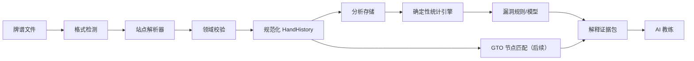

# RiverMind 架构 v0.1

## 设计原则

1. 牌谱原文不可直接进入 LLM；先解析、验证和脱敏。
2. 统计、GTO 和解释共享同一套规范化手牌与节点标识。
3. 确定性计算负责金额、行动、统计和 EV；LLM 只负责表达与课程组织。
4. 解析失败时显式报错，不用启发式猜测污染用户数据库。
5. Beta 优先离线复盘，不构建实时牌桌辅助链路。

## 数据流

## 第一阶段模块

| 模块 | 责任 | 当前状态 |
|---|---|---|
| Canonical Model | 玩家、筹码、行动、街道、牌面与结算 | 已建立 v0.1 |
| Parser Registry | 识别来源并路由到站点解析器 | 已建立 v0.1 |
| PokerStars Parser | 英文现金桌文本解析 | 第一条纵向切片 |
| Import Pipeline | 文件扫描、拆手、去重、失败隔离 | 待实现 |
| Analytics Store | 本地 DuckDB/Parquet 或服务端 ClickHouse | 待基准后决定 |
| Stats Engine | 固定核心指标和过滤 | 待实现 |
| Leak Engine | 基于证据的漏洞规则 | 待实现 |
| AI Coach | 证据约束解释 | 待实现 |
| GTO Matcher | 映射到验证解法 | Beta 可选 |

## 长期边界

策略服务输出 `PolicyDecision`，解释服务读取 `ExplanationEvidence`。解释服务永远不能生成被游戏引擎直接执行的动作字段。这条边界从数据模型和 API 权限两层实施。

