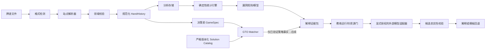

# RiverMind 架构 v0.4

## 设计原则

1. 牌谱原文不可直接进入 LLM；先解析、验证和脱敏。
2. 统计、GTO 和解释共享同一套规范化手牌与节点标识。
3. 确定性计算负责金额、行动、统计和 EV；LLM 只负责表达与课程组织。
4. 解析失败时显式报错，不用启发式猜测污染用户数据库。
5. Beta 优先离线复盘，不构建实时牌桌辅助链路。

## 数据流

## 第一阶段模块

| 模块 | 责任 | 当前状态 |
|---|---|---|
| Canonical Model | 玩家、筹码、行动、街道、牌面、现金/赛事元数据与结算 | 已建立 v0.3 |
| Parser Registry | 识别来源并路由到站点解析器 | 已建立 v0.1 |
| PokerStars Parser | 英文现金桌、付费 MTT、Freeroll 文本解析 | Cash v4 / MTT v2 |
| Import Pipeline | 文件扫描、拆手、去重、失败隔离 | v0.1 已实现 |
| Import Store | 导入审计、规范化 JSON、原文回放 | SQLite v0.1 已实现 |
| Analytics Store | 玩家–手牌统计宽表与维度索引 | SQLite v0.2，列式方案待百万手基准 |
| Stats Engine | 固定核心指标和机会分母 | 9 项翻前/Flop 指标 v0.2 |
| Accounting | 逐动作投入、返还、收池、净结果与守恒校验 | v0.1 已实现 |
| Reports | Session、相关手牌分页、结构化回放 | API/CLI v0.1 |
| Analysis Page | Leak Cards、AI 教练、核心统计、Session、最近手牌 | 本地 HTML v0.3 |
| Leak Engine | 版本化规则、样本门槛、Wilson 区间与证据手牌 | v0.1 已实现 |
| AI Coach | 脱敏证据、中文模板、候选输出校验与回退 | v0.3 已实现；默认使用模板 |
| Coach Runtime | 异步 Provider、超时重试、资源预算与无正文审计 | v0.2 已实现 |
| OpenAI Adapter | Responses API、严格 JSON Schema、拒绝/不完整处理 | v0.1 默认关闭；尚未真实调用 |
| Coach Eval Gate | 候选 schema、证据、数值、隐私和行动攻击面回归 | 50 例全部通过；真实专家质量集待收集 |
| Expert Review Gate | 盲化解释、双专家评分、不同证据数和 fatal error 门槛 | 工作流已实现；真实评分待收集 |
| GTO Matcher | 真实决策节点提取；精确/阈值近似/不支持；差异说明 | 元数据 v0.1 已实现；策略制品尚未接入 |

## GTO 元数据边界

`GameSpec` 不包含牌谱 ID 或玩家名，指纹由规范化 JSON 计算。`SolutionSpec` 只登记求解器、动作树、质量标签和制品哈希；Matcher 命中不等于策略内容已被加载。现金局缺 rake 结构、ICM/PKO 缺赛事上下文、硬维度不一致、阈值越界或最近候选并列时均失败关闭。完整契约与阈值见 [GTO_MATCHER.md](GTO_MATCHER.md)。

## 当前存储边界

SQLite 承担 Beta 的本地事务系统职责：导入批次、逐手状态、规范化载荷、原文、去重索引、`player_hand_stats` 指标宽表和 `player_hand_results` 结算表。派生表与原手牌在同一事务写入；v1/v2 数据库首次打开时分别自动回填指标与结果。后续依据 100k/1M 手牌基准决定是否把同一逻辑宽表迁移到 DuckDB/Parquet。

## 长期边界

策略服务输出 `PolicyDecision`，解释服务读取 `ExplanationEvidence`。解释服务永远不能生成被游戏引擎直接执行的动作字段。这条边界从数据模型和 API 权限两层实施。
